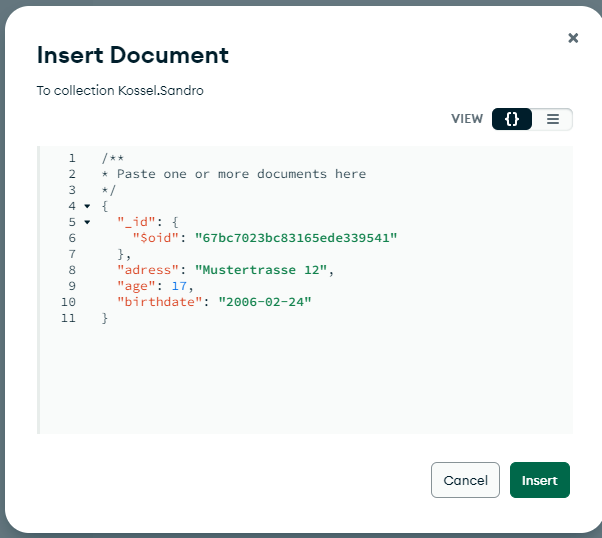

# Abgabe

## Aufgabe A)

### Ihre Cloud-Init Datei mit dem geänderten Passwort

```yaml
#cloud-config
users:
  - name: ubuntu
    sudo: ALL=(ALL) NOPASSWD:ALL
    groups: users, admin
    home: /home/ubuntu
    shell: /bin/bash
    ssh_authorized_keys:
      - ssh-rsa AAAAB3NzaC1yc2EAAAADAQABAAABAQCPIIO8uY8oWIihDv0tCAbX6toyG1RYkaLZyfGD1L+I07K4CnwAVBSU+81vw3Yv5sN9tj2Ccve9kzEeCNMld2mDP/Tt7edkx2MCToVfVx+njqwY/XbMY9bfdRKJLhIoLavuVNLnnkSIXdtlGr3JF71hPHzBDMEo64ofPCQ8hPsGxL1u3efb12jcWcRhudKtv7Qh6cVE47Zj4xImfi6VlLqwzcKZ5oCqR/z1hLLL+/pS3eM5Qsor5wmAqNfH4+z5eE+pOkFm7a0Nkygv9jwXIqtJzFGKYDe6ciBD04pEovdvY0FTyiv2vksQOVgjtu2faG2Iv1HOG0JktCIwJ49OEgjT teacher-key
      - ssh-rsa AAAAB3NzaC1yc2EAAAADAQABAAABAQC/V1D3vRaUTTMWmO7nQOOVTTxwiyXioeKHlInt+vAl21sCw55x/l1o+trABID4Sy6KfgMEyp3ZJXhAbrtLbt3EqaiyMleajdJlTT2MUnIXUe1z4Ju6JXy2/XNdK1KqgScCXg4d5iw3SwknxI4+JrjffCYuyFz3QtMcU2sozc0QDSWs2xlF19yqc1q4oCVuEiHVqZWypq42CKmDL1C2qY+1bwBeVl9ERS0ShMK/41ABU536Lng8mN+YR9Qd4fjjHfJ55WpN/deoHqHMdgs8P6VGHUqjkAya5pMl9cmiLYgmvNLft3d6Wj0UPkLHBa+QGvofdi5SZUr3l48RLxTsrXXl
ssh_pwauth: false
disable_root: false
package_update: true
packages:
  - unzip
  - gnupg
  - curl
write_files:
  - path: /home/ubuntu/mongodconfupdate.sh
    content: |
      sudo sed -i 's/#security:/security:\n  authorization: enabled/g' /etc/mongod.conf
  - path: /home/ubuntu/mongodbuser.txt
    content: |
      use admin;
      db.createUser(
        {
          user: "admin",
          pwd: "admin",
          roles: [
            { role: "userAdminAnyDatabase", db: "admin" },
            { role: "readWriteAnyDatabase", db: "admin" }
          ]
        }
      );

runcmd:
  - curl -fsSL https://pgp.mongodb.com/server-6.0.asc | sudo gpg -o /usr/share/keyrings/mongodb-server-6.0.gpg --dearmor
  - echo "deb [ arch=amd64,arm64 signed-by=/usr/share/keyrings/mongodb-server-6.0.gpg ] https://repo.mongodb.org/apt/ubuntu jammy/mongodb-org/6.0 multiverse" | sudo tee /etc/apt/sources.list.d/mongodb-org-6.0.list
  - sudo apt-get update -y
  - sudo apt-get install -y mongodb-org
  - sudo sed -i 's/127.0.0.1/0.0.0.0/g' /etc/mongod.conf
  - sudo chmod +x /home/ubuntu/mongodconfupdate.sh
  - sudo /home/ubuntu/mongodconfupdate.sh
  - sudo systemctl enable mongod
  - sudo systemctl start mongod
  - sudo mongosh < /home/ubuntu/mongodbuser.txt
  - sudo systemctl restart mongod

```

### 2. Screenshot von Compass mit der Liste der bereits bestehenden Datenbanken.


### 3. Schauen Sie sich Ihren Connection String an. Erklären Sie was die Option authSource=admin macht und wieso dieser Parameter so korrekt ist.  (Schauen Sie in den Quellen nach)
Antwort: Damit in der Datenbank Admin die Benutzer checken und mit einem solchen Benutzer kann man dann auf eine Datenbank verbinden.

### 4. Im cloud-init finden Sie zweimal den Linux Befehle sed.

### a.) Erklären Sie was die beiden Befehle bewirken. (Schauen Sie in den Quellen nach). Sie sollen erklären wieso die beiden Befehle notwendig sind, resp. was der Einfluss auf unsere MongoDB ist.

1. sed Befehl: sudo sed -i 's/#security:/security:\n  authorization: enabled/g' /etc/mongod.conf
Wieso notwendig?
Dieser Befehl ersetzt #security durch security:\n  authorization: enabled/g in der Datei /etc/mongod.conf.
Was ist der Einfluss auf MongoDB?
Somit wird die Authentifizierung aktiviert, dass nur berechtigte Nutzer auf die Datenbank zugreifen können.

2. sed Befehl:   - sudo sed -i 's/127.0.0.1/0.0.0.0/g' /etc/mongod.conf
Wieso notwendig?
Standardmässig ist MongoDB nur auf der IP-Adresse 127.0.0.1, also localhost, erreichbar. 
Dieser Befehl ersetzt die IP-Adresse mit 0.0.0.0, damit die Datenbank auf allen IP-Adressen erreichbar ist.
Was ist der Einfluss auf MongoDB?
Ermöglicht den Zugriff auf die Datenbank von anderen Geräten.

#### Allgemeine Erklärung zum sed Command


### b.) Zeigen Sie mit einem Screenshot den Inhalt der MongoDB Konfigurations-Datei in dem die beiden ersetzten Werte sichtbar sind. Sie können die Datei z.B. mit nano öffnen oder mit cat den Inhalt anzeigen lassen und mit grep filtern.


## Aufgabe B)
### 1. Screenshot (oder JSON) Ihres einzufügenden Dokuments (bevor Sie es einfügen)


### 2. Screenshot Ihrer Compass-Applikation mit der Datenbank, Collection und Dokument sichtbar, nachdem Sie den Datentyp geändert haben.


### 3. Export-Datei und Erklärung zu dem Datentyp mit möglichen Implikationen auf 
andere Datentypen. Wieso ist dieser komplizierte Weg notwendig, 
um ein Datum zu definieren?

```json
[{
  "_id": {
    "$oid": "67bc7023bc83165ede339541"
  },
  "adress": "Mustertrasse 12",
  "age": 17,
  "birthdate": {
    "$date": "2006-02-24T00:00:00.000Z"
  }
}]
```

##### Wieso so kompliziert?
JSON kennt nur primitive Datentypen wie String, Number, Boolean, Array und Object.
Deshalb muss ein Datum in einem Objekt definiert werden.
In MongoDB kann man mit "$date" direkt ein Datum angeben.

## Aufgabe C)
### Screenshot von Compass, der zeigt, dass Sie die Befehle eingegeben haben


### Screenshot von der MongoDB-Shell auf dem Linux-Server, der zeigt, dass Sie die Befehle eingegeben haben.


### Was machen die Befehle 1-5? Was ist der Unterschied zwischen Collections und Tables?
| Command             | Erklärung                                             |
|---------------------|-------------------------------------------------------|
| `show dbs;`         | Zeigt alle Datenbanken an.                            |
| `show databases;`   | Dasselbe wie `show dbs;`.                             |
| `use Kossel;`       | Wechselt zur Datenbank namens Kossel.                 |
| `show collections;` | Zeigt alle Collections der aktuellen Datenbank an.    |
| `show tables;`      | Alias für `show collections;` in MongoDB.             |
| `var test="hallo";` | Erstellt eine Variable `test` mit dem Wert `"hallo"`. |
| `test;`             | Gibt den Wert der Variable `test` aus.                |

#### Unterschied zwischen Collection und Table

| Collection (MongoDB) | Table (SQL) |
|----------------------|------------|
| Flexibles Schema (keine feste Struktur) | Striktes Schema (feste Spalten & Datentypen) |
| Speichert Dokumente im BSON-Format | Speichert Daten in Zeilen und Spalten |
