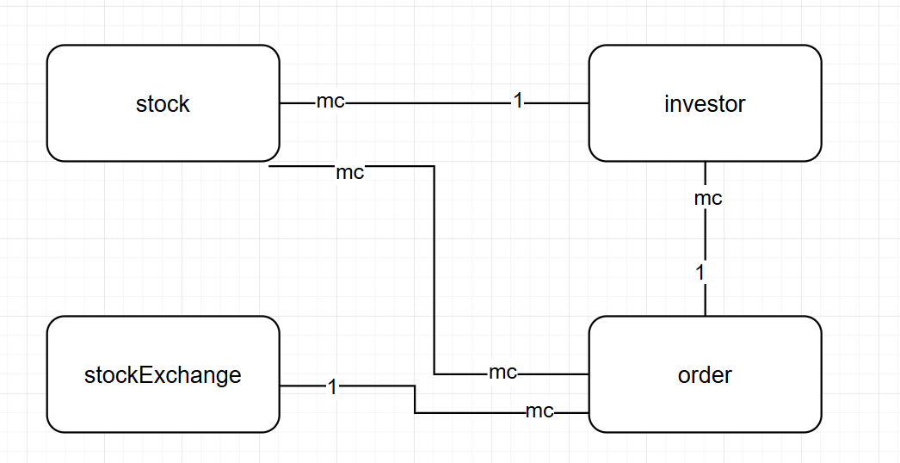
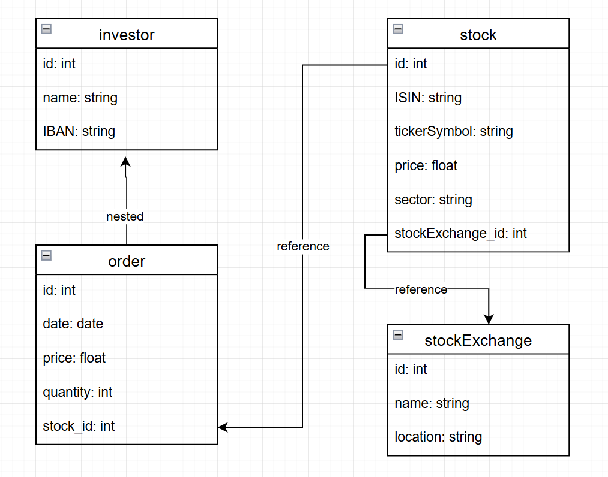

## Aufgabe A)

### Kurze textuelle Erklärungen zu den Entitäten und Beziehungen.
Ein Investor kann mehrere Aktien haben, aber eine Aktie kann nur von einem Investor gehalten werden.
Eine Aktie kann mehrere Orders haben und ein Order kann aus mehreren Aktien bestehen.
Eine Börse kann mehrere Orders haben und ein Order kann nur auf einer Börse plaziert werden.
Ein Investor kann nur einen Order auf eine bestimmte Aktie machen und derselbe Order kann von mehreren Investoren getätigt werden.

## Aufgabe B)

### Kurze textuelle Erklärungen zum logischen Modell
Man möchte ziemlich oft wissen, welche Order von einem Investor getätigt werden. Deshalb ist Order in Investor enthalten.
Orders gehören zu einem Investor, deshalb ist Order in Investor enthalten.
Da ein stock auch einzel abgefragt werden kann, ist er in einer einzelnen Tabelle. Er ist in order referenziert, da ein stock oft orders besitzt.
Ein stockExchange ist unabhängig von einem stock, deshalb ebenfalls eine weitere Tabelle gewählt und referenziert, um festzustellen, welche stockes an welcher Börse getradet werden. 
