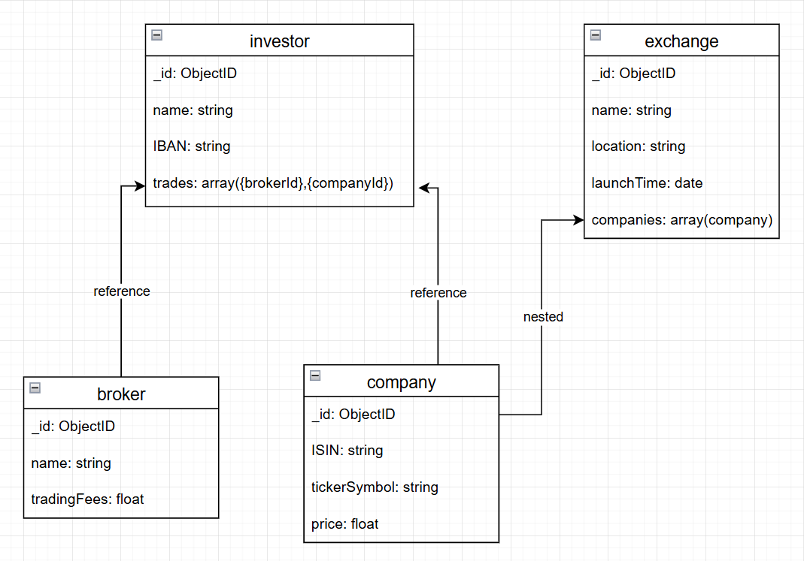

## Aufgabe A)


### Kurze textuelle Erklärungen zu den Entitäten und Beziehungen.
Ein Investor hat mit mehreren Brokern zu tun. Ein Broker kann meherere Investoren haben.
Ein Investor kann mehrere Aktien von Companies besitzen. Eine Company kann von mehrere Investoren besessen werden.
Ein Exchange kann mehrere Aktien von Companies haben. Eine Company nur an einem Exchange gehandelt werden.

## Aufgabe B)
### Ein Bild des logischen Datenmodells.


### Erklärung zu Verschachtelungen. wieso haben Sie Ihre Variante gewählt.
Ein Investor wird in einer Dreiecks Beziehung mit Broker und Company zusammen aufgerufen, da man wissen möchte, welcher Investor mit welchen Brokern zu tun hat und welche Anteile besitzt.
Ein Exchange kann auch Einzeln aufgerufen werden und kann alleine stehen.

## Aufgabe C)
### Script mit den Befehlen zur Erstellung der Collections.
```javascript
use stockMarket;

db.createCollection("investor");
db.createCollection("broker");
db.createCollection("company");
db.createCollection("exchange");
```
