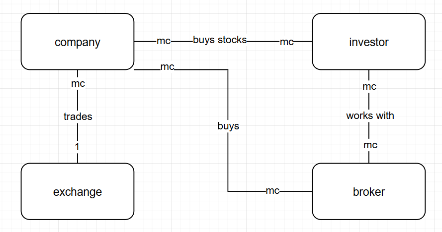
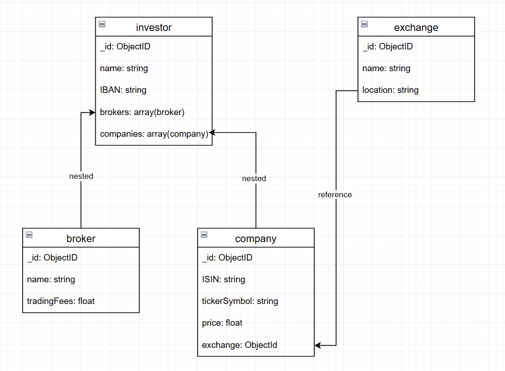

## Aufgabe A)


### Kurze textuelle Erklärungen zu den Entitäten und Beziehungen.
Ein Investor hat mit mehreren Brokern zu tun. Ein Broker kann meherere Investoren haben.
Ein Investor kann mehrere Aktien von Companies besitzen. Eine Company kann von mehrere Investoren besessen werden.
Ein Exchange kann mehrere Aktien von Companies haben. Eine Company nur an einem Exchange gehandelt werden.

## Aufgabe B)
### Ein Bild des logischen Datenmodells.


### Erklärung zu Verschachtelungen. wieso haben Sie Ihre Variante gewählt.
Man möchte ziemlich oft wissen, welche Order von einem Investor getätigt werden. Deshalb ist Order in Investor enthalten.
Orders gehören zu einem Investor, deshalb ist Order in Investor enthalten.
Da ein stock auch einzel abgefragt werden kann, ist er in einer einzelnen Tabelle. Er ist in order referenziert, da ein stock oft orders besitzt.
Ein stockExchange ist unabhängig von einem stock, deshalb ebenfalls eine weitere Tabelle gewählt und referenziert, um festzustellen, welche stockes an welcher Börse getradet werden. 

## Aufgabe C)
### Script mit den Befehlen zur Erstellung der Collections.
```javascript
use stockMarket;

db.createCollection("investor");
db.createCollection("stock");
db.createCollection("order");
db.createCollection("stockExchange");
```
