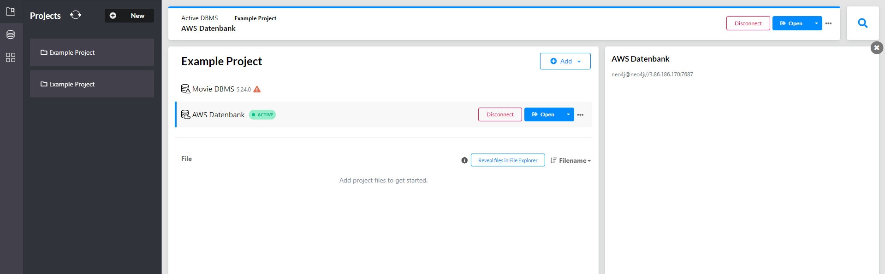
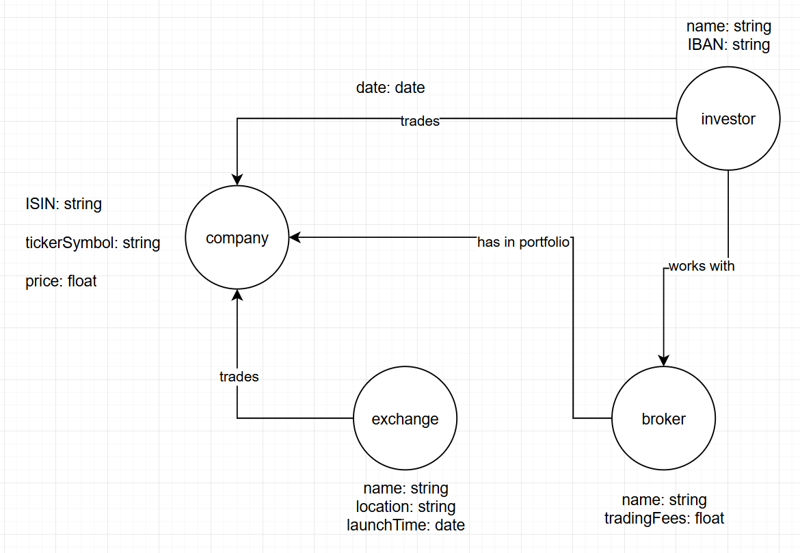

## Aufgabe A)

## Aufgabe B)

### Erklärung
- Die Arrays "trades" und "companies" braucht es nicht mehr, da sie schon in der Kante enthalten sind.
- Statt eine trade Collection zu erstellen kann ich die trades zwischen Investor und Company in der Kante speichern.
- Das Datum eines trades kann ich in der Kante von Investor zu Company speichern.

## KN-02 logisches Modell zeigen (aktuell nur 0.9 punkte) -> Trade Collection
