## Aufgabe A)
PW: Sandro07Root

alles löschen:
MATCH (n) DETACH DELETE n;

alle anzeigen:
MATCH (n) RETURN n;

## Aufgabe B)
Statement: MATCH (n) OPTIONAL MATCH (n)-[r]->(m) RETURN n, r, m;

- MATCH (n): Findet alle Knoten in der Datenbank
- OPTIONAL MATCH (n)-[r]->(m): sucht OPTIONAL nach Kanten zwischen den Knoten
- RETURN n, r, m: Gibt Knoten (n), optional gefundene Beziehungen (r) und verbundene Knoten (m) zurück

### Weitere Reads

1. Alle Unternehmen, die im Exchange "NASDAQ" gelistet sind und deren Aktienpreis über 200 liegt.
```
MATCH (ex:Exchange {name: "NASDAQ"})<-[:TRADES]-(co:Company)
WHERE co.price > 200
RETURN ex.name AS Exchange, co.tickerSymbol AS Company, co.price AS Price;
```
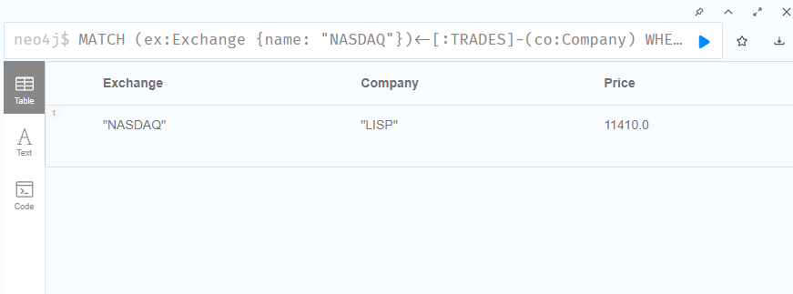

2. Alle Investoren, die über den Broker "DEGIRO" handeln.
```
MATCH (inv:Investor)-[t:TRADES]->(broker:Broker)
WHERE broker.name = "DEGIRO"
RETURN inv.name AS Investor, broker.name AS Broker, t.date AS Datum;
```
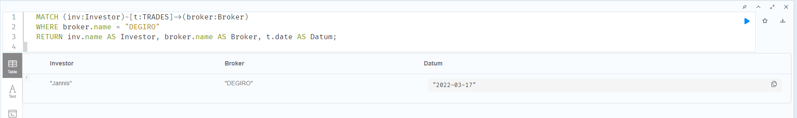

3. Alle Investoren, die in Unternehmen investiert haben, die an Exchanges gelistet sind, welche in den 1990er Jahren gelaunched wurden.
```
MATCH (ex:Exchange)<-[:TRADES]-(co:Company)<-[t:HAS_IN_PORTFOLIO]-(inv:Investor)
WHERE ex.launchTime >= date("1990-01-01") AND ex.launchTime < date("2000-01-01")
RETURN inv.name AS Investor, co.tickerSymbol AS Company, ex.name AS Exchange, ex.launchTime AS LaunchDate;
```
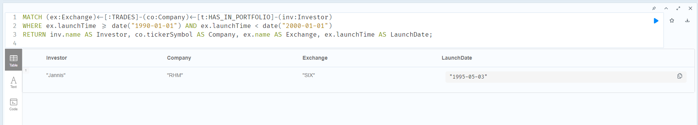

4. Zähle für jeden Broker, wie viele Handelsbeziehungen existieren.
```
MATCH (br:Broker)
OPTIONAL MATCH (inv:Investor)-[t:TRADES]->(br)
RETURN br.name, count(t)
```
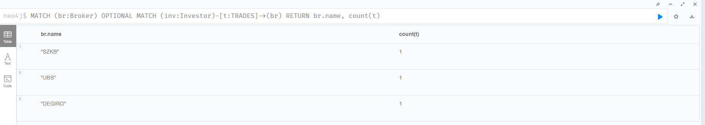


## Aufgabe C)

### vorher ohne Detach
```
MATCH (inv:Investor {name: "Sandro"})
DELETE inv;
```
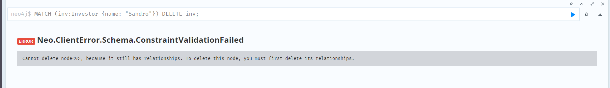

### nachher mit detach (löscht auch weitere Beziehungen)
```
MATCH (inv:Investor {name: "Sandro"})
DELETE inv;
```
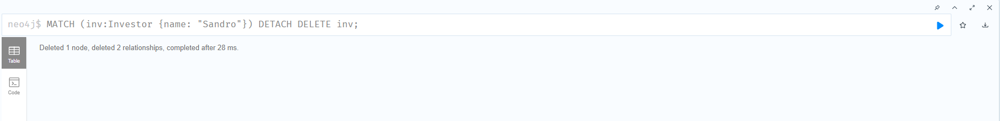

## Aufgabe D)
### Anpassung von Gebühren eines Brokers
```
MATCH (br:Broker {name: "DEGIRO"})
SET br.tradingFees = 3.00
RETURN br;
```
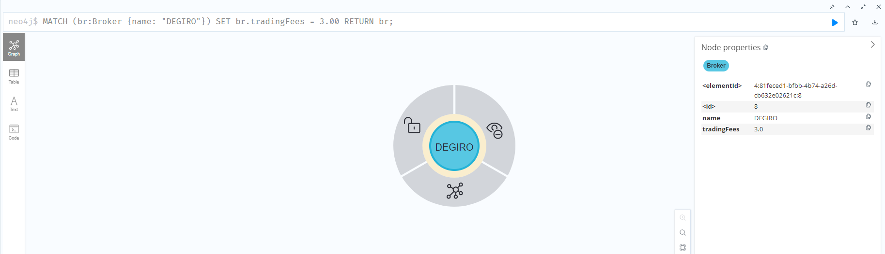

### Aktualisierung von Handelsdatum
```
MATCH (inv:Investor {name: "Jannis"})-[t:TRADES]->(br:Broker {name: "DEGIRO"})
SET t.date = date("2025-04-07")
RETURN inv, t, br;
```
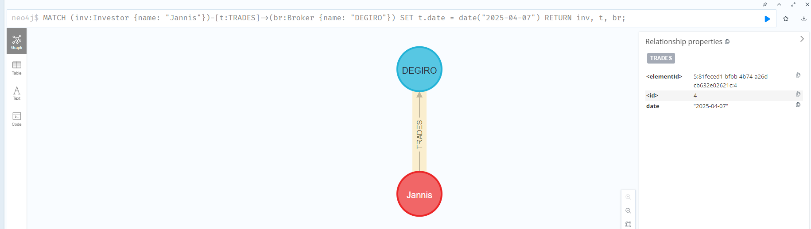

### Aktienkurs einer Company ändern
```
MATCH (c:Company {tickerSymbol:"AAPL"})-[t:TRADES]->(e:Exchange {name:"FBW"})
SET c.price = 250.00
RETURN c, e;
```
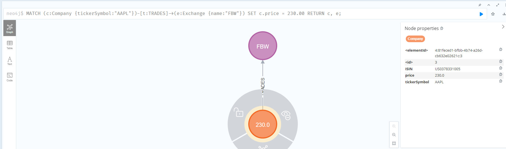

## Aufgabe E)
### ORDER BY
```
MATCH (c:Company)
RETURN c.price
ORDER BY c.price DESC;
```
##### Erklärung:
MATCH (c:Company): sucht alle Knoten namens Company
RETURN c.price: gibt den Preis der Company zurück
ORDER BY c.price DESC: sortiert die Preise in absteigender Reihenfolge
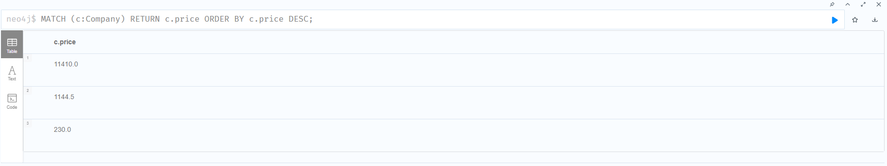

### LIMIT
```
MATCH (i:Investor) 
RETURN i.name
LIMIT 2;
```
##### Erklärung: 
MATCH (i:Investor): sucht alle Knoten namens Investor
RETURN i.name: gibt den Namen der Investoren zurück
LIMIT 2: nur 2 der 3 Investoren werden zurückgegeben
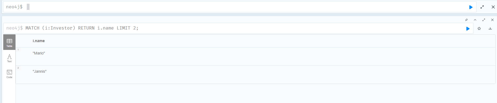
