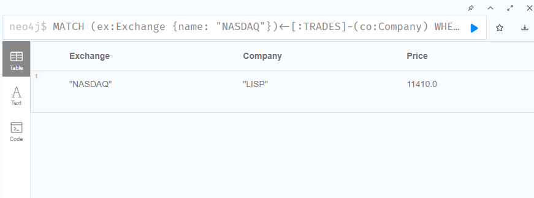

## Aufgabe A)
PW: Sandro07Root

alles löschen:
MATCH (n) DETACH DELETE n;

alle anzeigen:
MATCH (n) RETURN n;

## Aufgabe B)
Statement: MATCH (n) OPTIONAL MATCH (n)-[r]->(m) RETURN n, r, m;

- MATCH (n): Findet alle Knoten in der Datenbank
- OPTIONAL MATCH (n)-[r]->(m): sucht OPTIONAL nach Kanten zwischen den Knoten
- RETURN n, r, m: Gibt Knoten (n), optional gefundene Beziehungen (r) und verbundene Knoten (m) zurück

### Weitere Reads

1. Alle Unternehmen, die im Exchange "NASDAQ" gelistet sind und deren Aktienpreis über 200 liegt.
MATCH (ex:Exchange {name: "NASDAQ"})<-[:TRADES]-(co:Company)
WHERE co.price > 200
RETURN ex.name AS Exchange, co.tickerSymbol AS Company, co.price AS Price;

2. Alle Investoren, die über den Broker "DEGIRO" handeln.
MATCH (inv:Investor)-[t:TRADE]->(co:Company)
WHERE t.broker = "DEGIRO"
RETURN inv.name AS Investor, co.tickerSymbol AS Company, t.broker AS Broker;

3. Alle Investoren, die in Unternehmen investiert haben, die an Exchanges gelistet sind, welche in den 1990er Jahren gelaunched wurden.
MATCH (ex:Exchange)<-[:TRADES]-(co:Company)<-[t:TRADE]-(inv:Investor)
WHERE ex.launchTime >= date("1990-01-01") AND ex.launchTime < date("2000-01-01")
RETURN inv.name AS Investor, co.tickerSymbol AS Company, ex.name AS Exchange, ex.launchTime AS LaunchDate;

4. Zähle für jeden Broker, wie viele Handelsbeziehungen existieren.
MATCH (br:Broker)
OPTIONAL MATCH (inv:Investor)-[t:TRADE]->(co:Company)
WHERE t.broker = br.name
RETURN br.name AS Broker, count(t) AS TradeCount;

### aktuell hier dran. 1. comamnd gibt resultat zurück. andere 3 leider nur leere aber keinen fehler.
mit neo4j desktop gemacht 
