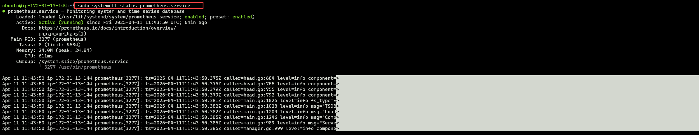
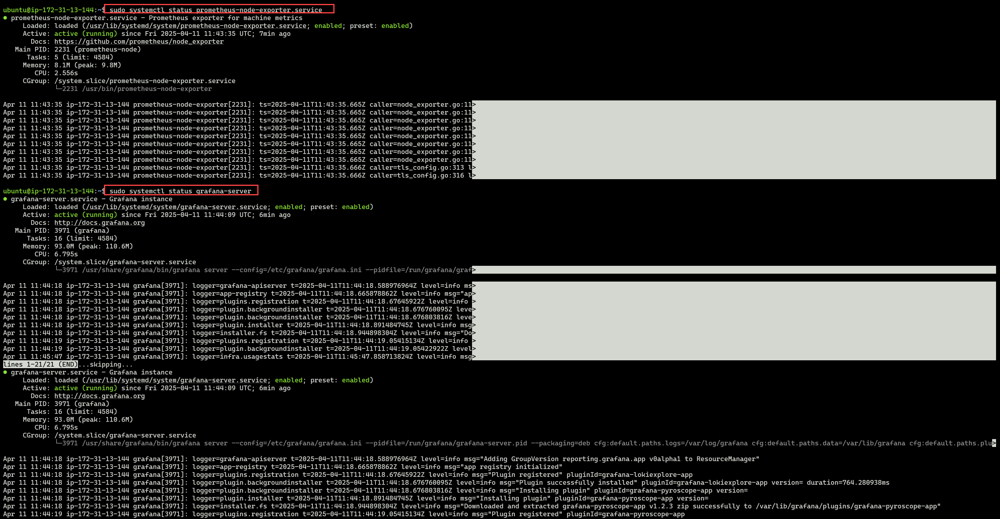
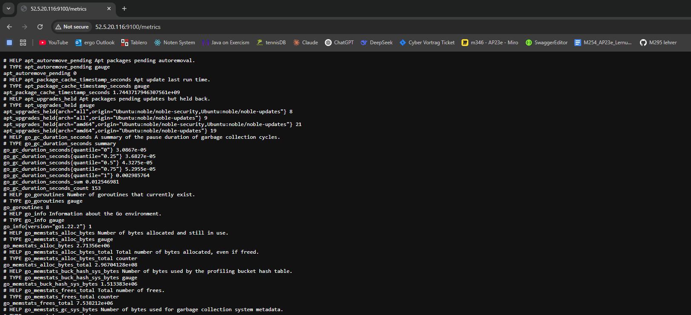
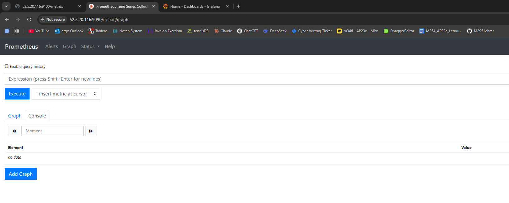
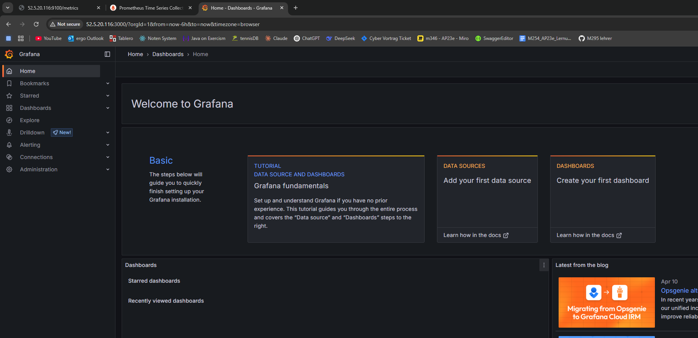
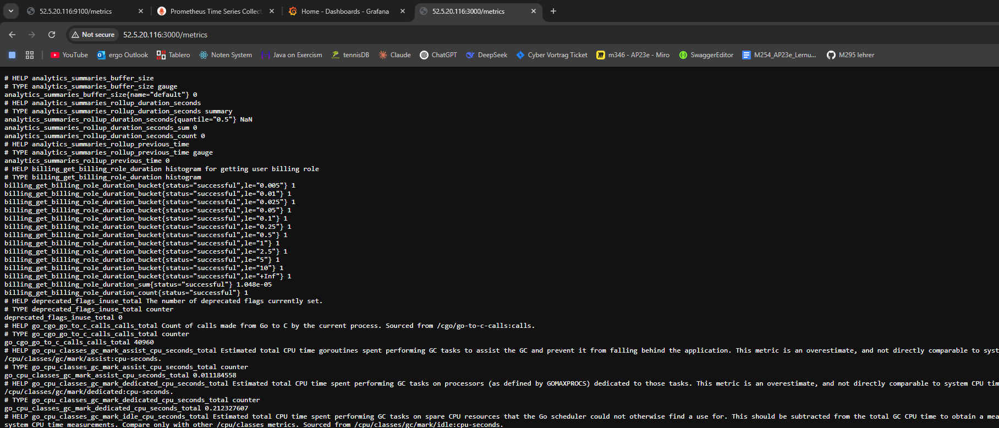

## Aufgabe A)
### Tests



### URLs

#### Prometheus Node-Exporter Metrics:


#### Prometheus Dashboard:


#### Grafana Dashboard:


#### Grafana Metrics für Prometheus


## Aufgabe B

### Was sind Scrapes? Erklären Sie den Begriff im Zusammenhang mit Prometheus und geben Sie konkrete Beispiele.
Scrapes sind die Requests, die Prometheus an die überwachten Systeme sendet. In diesem Cloud init werden diese all 15 Sekunden gesendet. Die Requests sind dafür da, um den Status, Ressourcenverbrach und Performance zu überwachen (regelmässige Metriken abfragen).
```
      global:
        scrape_interval: 15s
```
1. System:
```
      - job_name: 'prometheus'
        static_configs:
          - targets: ['localhost:9090']
```
2. System:
```
      - job_name: 'node'
        static_configs:
          - targets: ['localhost:9100']
```
gesamter Codeabschnitt
```
write_files:
  - path: /etc/prometheus/prometheus.yml
    permissions: '0644'
    content: |
      global:
        scrape_interval: 15s
      scrape_configs:
        - job_name: prometheus
          static_configs:
            - targets: ['localhost:9090']
        - job_name: node
          static_configs:
            - targets: ['localhost:9100']
      rule_files:
        - "/etc/prometheus/rules.yml"
```

### Was sind Rules? Erklären Sie den Begriff im Zusammenhang mit Prometheus und geben Sie konkrete Beispiele.
Es gibt 2 Arten von Rules:
1. Recording Rules:
```
            - record: node_memory_MemFree_percent
              expr: 100 - (100 * node_memory_MemFree_bytes / node_memory_MemTotal_bytes)
            - record: node_filesystem_free_percent
              expr: 100 * node_filesystem_free_bytes{mountpoint="/"} / node_filesystem_size_bytes{mountpoint="/"}
```
Berechnen bei der Abfrage der Metriken den Prozentsatz des freien Speichers (Memory) und der freien Festplatte (Filesystem).

2. Alerting Rules:
```
            - alert: InstanceDown
              expr: up == 0
              for: 1m
              labels:
                serverity: critical
              annotations:
                summary: "Instance {{ $labels.instance }} down"
                description: "Instance {{ $labels.instance }} of job {{ $labels.job }} has been down for more than 1 minute."
```
Alarmieren bei einem Ausfall eines Systems. Wenn der Status des Systems 1 Minute lang down ist, wird ein Alarm ausgelöst.


### Was sind die Schritte, die Sie als Programmierer ausführen müssen, um eigene Daten in Prometheus zu speichern?
1. Prometheus installieren
Installation in der Cloud init Datei
```
packages:
  - apt-transport-https
  - software-properties-common
  - wget
  - prometheus
  - prometheus-node-exporter
```

2. Prometheus konfigurieren, damit etwas gescraped wird
In prometheus.yml Ziele (targets) hinzufügen, damit Prometheus diese regelmässig abfragt, um Metriken zu sammeln.
```
write_files:
  - path: /etc/prometheus/prometheus.yml
```

3. (Optional) Metriken visualisieren
Nutzung eines Tools wie Grafana, um die gesammelten Daten übersichtlich darzustellen.

### Welche Variablen werden verwendet in den Scrapes und Rules und von welchen Seiten/URLs kommen diese Variablen?
Variablen in Scrapes:
- job_name: Name des Jobs, der gescraped wird (z.B. prometheus, node)
- targets: Liste der IP-Adressen oder Hostnamen, die gescraped werden sollen (z.B. localhost:9090, localhost:9100)
Variablen in Rules:
- record: Name der Regel, die erstellt wird (z.B. node_memory_MemFree_percent)
- expr: Ausdruck, der die Regel definiert (z.B. 100 - (100 * node_memory_MemFree_bytes / node_memory_MemTotal_bytes))
- alert: Name des Alarms, der ausgelöst wird (z.B. InstanceDown)
- for: Zeitspanne, die der Alarm aktiv sein muss, bevor er ausgelöst wird (z.B. 1m)
- labels: Labels, die dem Alarm zugewiesen werden (z.B. serverity: critical)
- annotations: Anmerkungen, die dem Alarm zugewiesen werden (z.B. summary, description)
Herkunft der Variablen:
- job_name, targets, record, expr, alert, for, labels und annotations sind alle in der Konfiguration von Prometheus definiert.
- node_memory_MemFree_percent, node_memory_MemFree_bytes, node_filesystem_free_bytes sind von Node Exporter (http://localhost:9100/metrics)

### Wie weiss Prometheus, ob ein System up ist (siehe Regeln bei den Alerting Rules).
up = 1 → Das System ist erreichbar. Prometheus konnte erfolgreich Metriken scrapen.
up = 0 → Das System ist nicht erreichbar. Prometheus konnte keine Metriken abrufen (Timeout).
