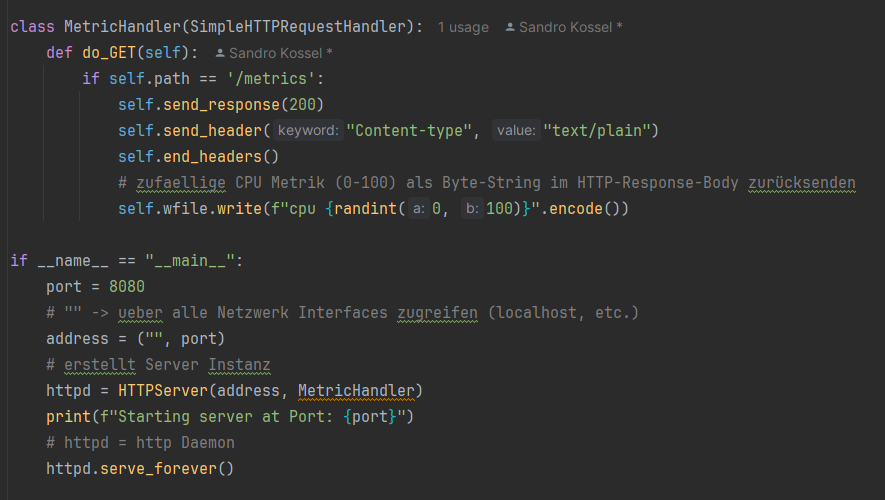
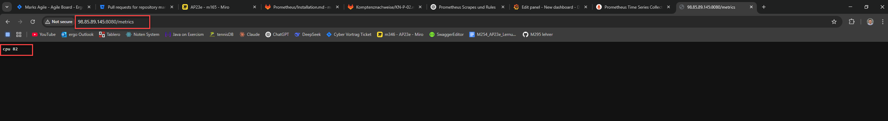
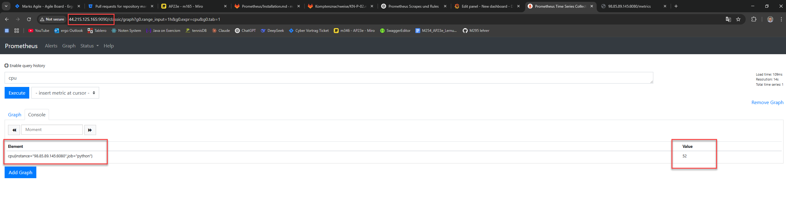
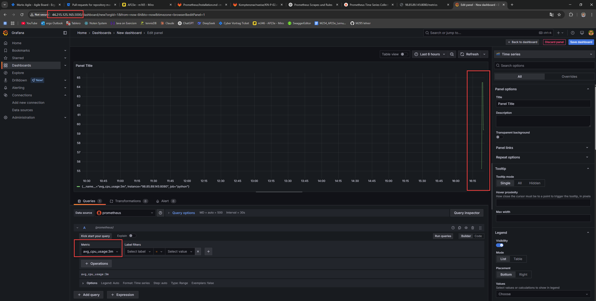

## Aufgabe a)
### eigene Metrik schreiben
## 1.) Pyhton Server erstellt 


## 2.) bei Aufruf von http://localhost:8000/metrics wird die random Zahl zwischen 0-100 (CPU Auslastung) zurückgegeben


## Aufgabe b)
## 3.) Server bereitstellen
```python
class MetricHandler(SimpleHTTPRequestHandler):
    def do_GET(self):
        if self.path == '/metrics':
            self.send_response(200)
            self.send_header("Content-type", "text/plain")
            self.end_headers()
            # zufaellige CPU Metrik (0-100) als Byte-String im HTTP-Response-Body zurücksenden
            self.wfile.write(f"cpu {randint(0, 100)}".encode())

if __name__ == "__main__":
    port = 8080
    # "" -> ueber alle Netzwerk Interfaces zugreifen (localhost, etc.)
    address = ("", port)
    # erstellt Server Instanz
    httpd = HTTPServer(address, MetricHandler)
    print(f"Starting server at Port: {port}")
    # httpd = http Daemon
    httpd.serve_forever()
```

## 4.) AWS Instanz für Server
```yaml
#cloud-config
users:
  - name: ubuntu
    sudo: ALL=(ALL) NOPASSWD:ALL
    groups: users, admin
    home: /home/ubuntu
    shell: /bin/bash
    ssh_authorized_keys:
      - ssh-rsa AAAAB3NzaC1yc2EAAAADAQABAAABAQCPIIO8uY8oWIihDv0tCAbX6toyG1RYkaLZyfGD1L+I07K4CnwAVBSU+81vw3Yv5sN9tj2Ccve9kzEeCNMld2mDP/Tt7edkx2MCToVfVx+njqwY/XbMY9bfdRKJLhIoLavuVNLnnkSIXdtlGr3JF71hPHzBDMEo64ofPCQ8hPsGxL1u3efb12jcWcRhudKtv7Qh6cVE47Zj4xImfi6VlLqwzcKZ5oCqR/z1hLLL+/pS3eM5Qsor5wmAqNfH4+z5eE+pOkFm7a0Nkygv9jwXIqtJzFGKYDe6ciBD04pEovdvY0FTyiv2vksQOVgjtu2faG2Iv1HOG0JktCIwJ49OEgjT teacher
      - ssh-rsa AAAAB3NzaC1yc2EAAAADAQABAAABAQC/V1D3vRaUTTMWmO7nQOOVTTxwiyXioeKHlInt+vAl21sCw55x/l1o+trABID4Sy6KfgMEyp3ZJXhAbrtLbt3EqaiyMleajdJlTT2MUnIXUe1z4Ju6JXy2/XNdK1KqgScCXg4d5iw3SwknxI4+JrjffCYuyFz3QtMcU2sozc0QDSWs2xlF19yqc1q4oCVuEiHVqZWypq42CKmDL1C2qY+1bwBeVl9ERS0ShMK/41ABU536Lng8mN+YR9Qd4fjjHfJ55WpN/deoHqHMdgs8P6VGHUqjkAya5pMl9cmiLYgmvNLft3d6Wj0UPkLHBa+QGvofdi5SZUr3l48RLxTsrXXl
ssh_pwauth: false
disable_root: false
package_update: true
packages:
  - python3
write_files:
  - path: ~/app/server.py
    # benötigt zum Ausführen des Skripts
    permissions: '0777'
    # server config
    content: |
      from http.server import HTTPServer, SimpleHTTPRequestHandler
      from random import randint


      class MetricHandler(SimpleHTTPRequestHandler):
          def do_GET(self):
              if self.path == '/metrics':
                  self.send_response(200)
                  self.send_header("Content-type", "text/plain")
                  self.end_headers()
                  self.wfile.write(f"cpu {randint(0, 100)}".encode())

      if __name__ == "__main__":
          port = 8080
          address = ("", port)
          httpd = HTTPServer(address, MetricHandler)
          print(f"Starting server at Port: {port}")
          httpd.serve_forever()
runcmd:
  - python3 ~/app/server.py
```

## 5.) AWS Instanz für prometheus
```yaml
#cloud-config
users:
  - name: ubuntu
    sudo: ALL=(ALL) NOPASSWD:ALL
    groups: users, admin
    home: /home/ubuntu
    shell: /bin/bash
    ssh_authorized_keys:
      - ssh-rsa AAAAB3NzaC1yc2EAAAADAQABAAABAQCPIIO8uY8oWIihDv0tCAbX6toyG1RYkaLZyfGD1L+I07K4CnwAVBSU+81vw3Yv5sN9tj2Ccve9kzEeCNMld2mDP/Tt7edkx2MCToVfVx+njqwY/XbMY9bfdRKJLhIoLavuVNLnnkSIXdtlGr3JF71hPHzBDMEo64ofPCQ8hPsGxL1u3efb12jcWcRhudKtv7Qh6cVE47Zj4xImfi6VlLqwzcKZ5oCqR/z1hLLL+/pS3eM5Qsor5wmAqNfH4+z5eE+pOkFm7a0Nkygv9jwXIqtJzFGKYDe6ciBD04pEovdvY0FTyiv2vksQOVgjtu2faG2Iv1HOG0JktCIwJ49OEgjT teacher
      - ssh-rsa AAAAB3NzaC1yc2EAAAADAQABAAABAQC/V1D3vRaUTTMWmO7nQOOVTTxwiyXioeKHlInt+vAl21sCw55x/l1o+trABID4Sy6KfgMEyp3ZJXhAbrtLbt3EqaiyMleajdJlTT2MUnIXUe1z4Ju6JXy2/XNdK1KqgScCXg4d5iw3SwknxI4+JrjffCYuyFz3QtMcU2sozc0QDSWs2xlF19yqc1q4oCVuEiHVqZWypq42CKmDL1C2qY+1bwBeVl9ERS0ShMK/41ABU536Lng8mN+YR9Qd4fjjHfJ55WpN/deoHqHMdgs8P6VGHUqjkAya5pMl9cmiLYgmvNLft3d6Wj0UPkLHBa+QGvofdi5SZUr3l48RLxTsrXXl
ssh_pwauth: true
disable_root: false
package_update: true
packages:
  - apt-transport-https
  - software-properties-common
  - wget
  - prometheus
  - prometheus-node-exporter
write_files:
  - path: /etc/prometheus/prometheus.yml
    permissions: '0644'
    content: |
      global:
        scrape_interval: 15s
      scrape_configs:
        - job_name: python
          static_configs:
# Public IP von Server Instanz und Port auf dem Server läuft
            - targets: ['98.85.89.145:8080']
      rule_files:
        - "/etc/prometheus/rules.yml"
  - path: /etc/prometheus/rules.yml
    permissions: '0644'
    content: |
      groups:
        - name: custom_rules
          rules:
            - record: avg_cpu_usage:3m
              expr: avg_over_time(cpu[3m])
        - name: alert_rules
          rules:
            - alert: InstanceDown
              expr: up == 0
              for: 1m
              labels:
                severity: critical
              annotations:
                summary: "Instance {{ $labels.instance }} down"
            - alert: HighCpuUsageWarning
# wenn Zahl groesser als 90 ist gibt es einen alert
              expr: cpu > 90
              labels:
                severity: critical
              annotations:
                summary: "Die CPU-Nutzung ist über 90%!"
                description: "Die CPU-Nutzung liegt bei {{ $value }}"
runcmd:
  - sudo systemctl enable prometheus.service
  - sudo systemctl start prometheus.service
  - sudo systemctl enable prometheus-node-exporter.service
  - sudo systemctl start prometheus-node-exporter.service
  - sudo systemctl restart prometheus
  - sudo mkdir -p /etc/apt/keyrings/
  - wget -q -O - https://apt.grafana.com/gpg.key | gpg --dearmor | sudo tee /etc/apt/keyrings/grafana.gpg > /dev/null
  - echo "deb [signed-by=/etc/apt/keyrings/grafana.gpg] https://apt.grafana.com stable main" | sudo tee -a /etc/apt/sources.list.d/grafana.list
  - sudo apt-get update -y
  - sudo apt-get install grafana-enterprise -y
  - sudo systemctl daemon-reload
  - sudo systemctl start grafana-server
  - sudo systemctl enable grafana-server.service
  - sudo systemctl restart grafana-server
```

## 6.) Prometheus kann diese CPU Metrik abfragen


## 7.) Grafana kann diese Metrik grafisch darstellen
